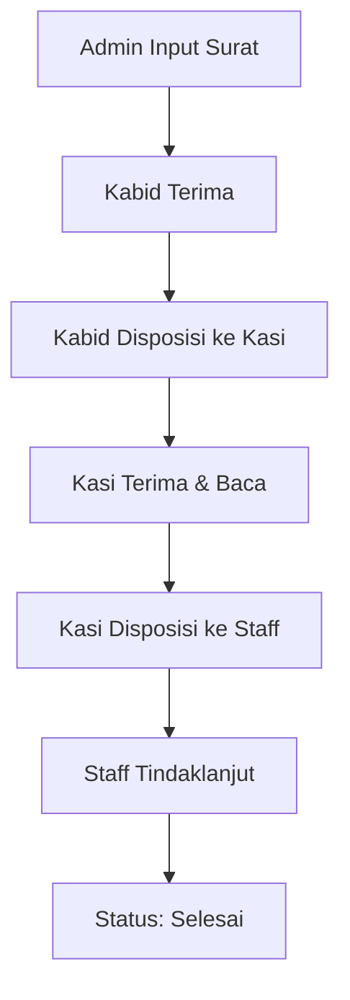
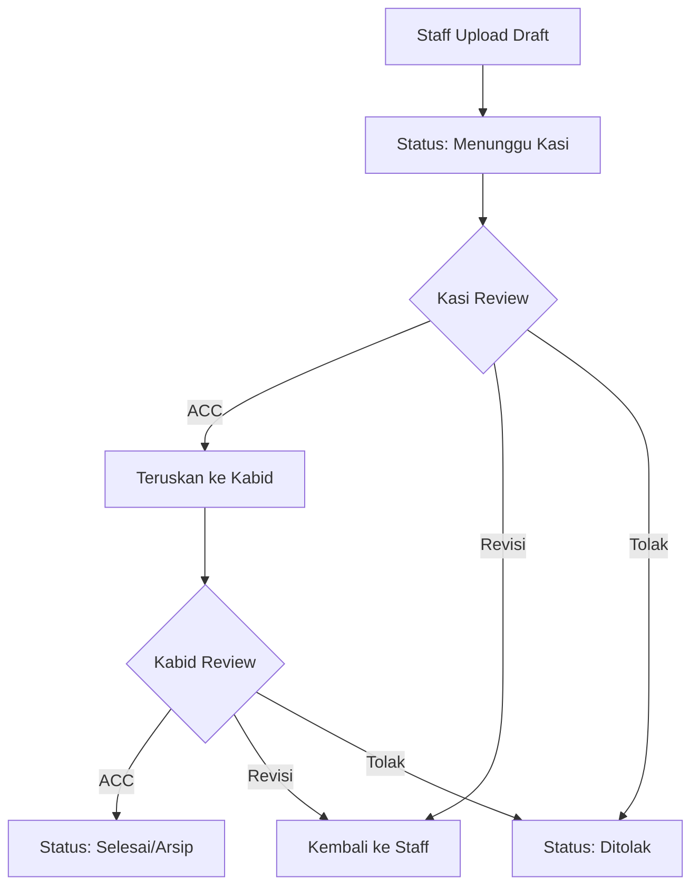
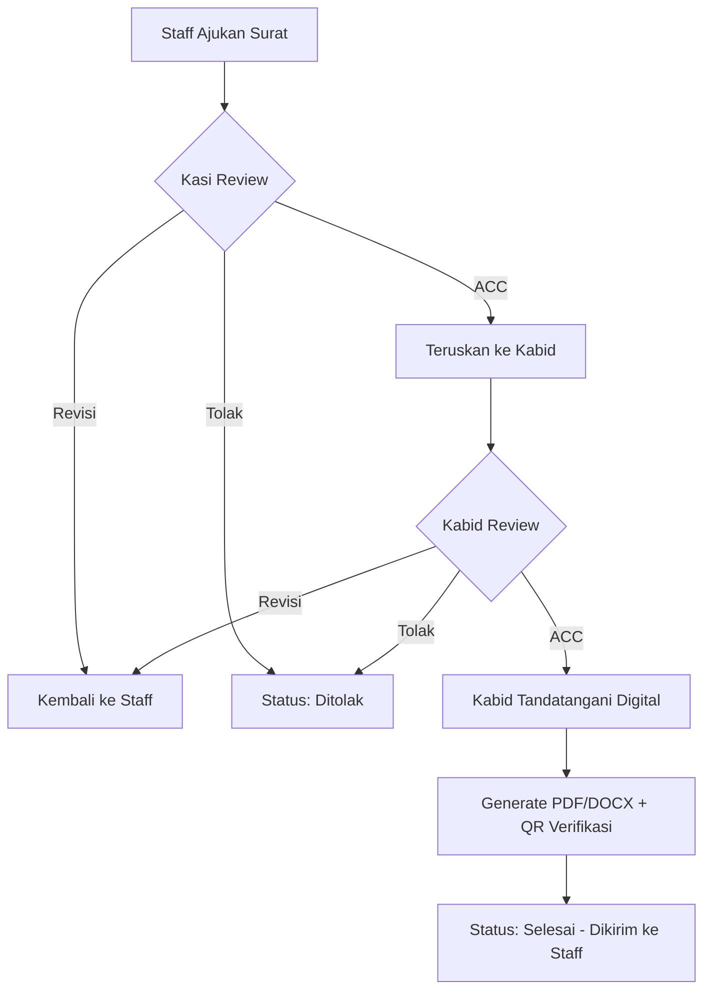

# 📋 Sistem E-Arsip Surat Hierarki

Aplikasi **E-Arsip Surat** untuk mengelola **Surat Masuk**, **Surat Keluar**, dan **Pengajuan Surat** (Cuti, Tugas, Nota Dinas, Undangan Rapat) dengan alur kerja **hierarki jabatan** (Kabid → Kasi → Staff), **disposisi berjenjang multi-target**, **tanda tangan digital** dengan verifikasi QR, dan **monitoring status posisi surat** secara real-time.

---

## 📑 Daftar Isi

-   [Gambaran Umum](#-gambaran-umum)
-   [Fitur Utama](#-fitur-utama)
-   [Role & Hak Akses](#-role--hak-akses)
-   [Alur Proses](#-alur-proses)
-   [Teknologi](#-teknologi)
-   [Instalasi](#-instalasi)
-   [Akun Demo](#-akun-demo)
-   [Screenshot](#-screenshot)
-   [Keamanan](#-keamanan)
-   [Lisensi](#-lisensi)

---

## 🎯 Gambaran Umum

Sistem ini dirancang untuk kebutuhan pengarsipan surat digital di lingkungan instansi pemerintahan atau organisasi, dengan penekanan pada:

-   ✅ **Hierarki atasan–bawahan** untuk alur disposisi dan approval yang realistis dan terkontrol
-   📊 **Tracking progres** real-time untuk monitoring status surat
-   ✔️ **Validasi berjenjang** dengan approval multi-level
-   🔏 **Tanda tangan digital** (RSA-2048/SHA-512) yang dapat diverifikasi publik lewat kode atau QR code
-   🔒 **Role-based access control** untuk keamanan data

---

## ✨ Fitur Utama

### 📥 Manajemen Surat Masuk

-   Input metadata surat dengan upload dokumen PDF/DOC/DOCX
-   Disposisi berjenjang: Kabid → Kasi → Staff
-   Tracking status: Menunggu Disposisi / Di Meja Kabid/Kasi/Staff / Selesai
-   Wajib baca sebelum disposisi (read tracking)
-   Multi-target disposisi (bisa kirim ke beberapa penerima sekaligus)

### 📤 Manajemen Surat Keluar

-   Upload draft dari Staff dengan validasi bertingkat
-   Review Kasi → Review Kabid (ACC final)
-   Opsi keputusan: ACC / Revisi / Tolak dengan catatan
-   Notifikasi otomatis untuk setiap perubahan status

### 📝 Pengajuan Surat (Cuti, Tugas, Nota Dinas, Undangan Rapat)

-   Staff mengajukan lewat form dinamis sesuai jenis surat (`Surat Cuti`, `Surat Tugas`, `Nota Dinas`, `Surat Undangan Rapat`)
-   Alur approval berjenjang: **Staff ajukan → Kasi periksa/ACC/Revisi/Tolak → Kabid ACC final & tanda tangan**
-   Perhitungan hari cuti otomatis **mengecualikan akhir pekan & hari libur nasional** (data hari libur diambil dari API publik)
-   Dokumen final di-generate otomatis dalam format **PDF & DOCX** sesuai template resmi tiap jenis surat
-   Riwayat lengkap setiap perubahan status untuk audit trail

### 🔏 Tanda Tangan Digital & Verifikasi

-   Kabid menandatangani dokumen final memakai kriptografi asimetris **RSA-2048 + hashing SHA-512**
-   Setiap dokumen mendapat **kode verifikasi unik** (`ES-XXXXXXXXXX`) dan **QR code** yang ditempel langsung di file PDF/DOCX
-   Halaman publik `/verifikasi` untuk mengecek keaslian dokumen — masukkan kode atau scan QR, bisa juga upload file untuk dicocokkan hash-nya
-   Setiap pengecekan tercatat di log verifikasi (audit trail keaslian dokumen)

### 👥 Role-Based Access Control

-   4 Role: Admin, Kabid (Kepala Bidang), Kasi (Kepala Seksi), Staff
-   Akses halaman dan fitur menyesuaikan role
-   Data terisolasi berdasarkan hierarki
-   Akun pengguna dibuat oleh Admin (tidak ada pendaftaran mandiri/self-register)

### 🌳 Hierarki Organisasi

-   Struktur parent-child (Kabid → Kasi → Staff)
-   List penerima disposisi/approval otomatis sesuai bawahan langsung
-   Validasi hierarki untuk mencegah disposisi atau approval tidak valid

### 🔍 Pencarian & Filter

-   Filter berdasarkan tahun, bulan, status
-   Pencarian nomor surat, perihal, pengirim
-   Active filter badges untuk UX yang lebih baik

### 📊 Dashboard & Statistik

-   Monitoring real-time posisi semua surat
-   Statistik per role (pending, selesai, ditolak, revisi)
-   Ringkasan produktivitas dan efisiensi

---

## 👤 Role & Hak Akses

| Role                         | Hak Akses Inti                                                                                                                                                                    |
| ----------------------------- | ---------------------------------------------------------------------------------------------------------------------------------------------------------------------------------- |
| **Admin**                    | • Input surat masuk & upload dokumen<br>• Manajemen akun & role<br>• Kelola master jenis surat<br>• Monitoring semua proses surat<br>• Akses ke semua data sistem                    |
| **Kabid**<br>(Kepala Bidang) | • Terima disposisi surat masuk<br>• Disposisi ke Kasi bawahan<br>• Validasi/ACC final surat keluar & pengajuan surat<br>• **Tanda tangan digital** dokumen final<br>• View riwayat keputusan |
| **Kasi**<br>(Kepala Seksi)   | • Terima disposisi dari Kabid<br>• Disposisi ke Staff bawahan<br>• Review & validasi surat keluar / pengajuan surat dari Staff<br>• Monitoring tugas tim                             |
| **Staff**<br>(Pelaksana)     | • Terima disposisi dari Kasi<br>• Tindaklanjut surat masuk<br>• Upload draft surat keluar<br>• Ajukan Surat Cuti/Tugas/Nota Dinas/Undangan<br>• Revisi surat yang ditolak            |

---

## 🔄 Alur Proses

### 1️⃣ Surat Masuk (Top-Down)



**Detail Proses:**

1. **Admin** input surat masuk + upload dokumen (PDF/DOC/DOCX)
2. Sistem otomatis kirim ke **Kabid** dengan status "Menunggu Disposisi Kabid"
3. **Kabid** wajib baca dulu, baru bisa **disposisi ke Kasi** (pilih 1 atau lebih Kasi)
4. **Kasi** terima disposisi → wajib baca → **disposisi ke Staff** bawahan langsung
5. **Staff** tindaklanjut → saat dibuka, status otomatis menjadi **"Selesai"**

### 2️⃣ Surat Keluar (Bottom-Up)



**Detail Proses:**

1. **Staff** upload draft surat keluar (PDF/DOC/DOCX) + perihal
2. **Kasi** review → opsi: **ACC** / **Revisi** / **Tolak** + catatan
3. Jika ACC → diteruskan ke **Kabid**
4. **Kabid** review → **ACC final** → surat menjadi arsip resmi
5. Jika revisi/tolak → notifikasi ke Staff untuk perbaikan

### 3️⃣ Pengajuan Surat & Tanda Tangan Digital (Bottom-Up)



**Detail Proses:**

1. **Staff** mengajukan surat (Cuti/Tugas/Nota Dinas/Undangan) lewat form sesuai jenisnya
2. **Kasi** memeriksa → **ACC** / **Revisi** / **Tolak** + catatan
3. Jika ACC → diteruskan ke **Kabid** untuk approval final
4. **Kabid** ACC final → klik **Tandatangani** → sistem membuat tanda tangan digital (RSA-2048/SHA-512) dan menempelkan QR verifikasi ke dokumen final
5. Dokumen final (PDF & DOCX) otomatis dikirim kembali ke **Staff** pemohon, status menjadi **Selesai**
6. Siapa pun dapat memverifikasi keaslian dokumen lewat halaman publik `/verifikasi`

> 📌 **Catatan Penting:**
>
> -   Setiap level harus membaca/memeriksa dokumen sebelum bisa ambil keputusan
> -   Catatan wajib diisi saat revisi atau tolak
> -   History semua keputusan tersimpan untuk audit trail
> -   Satu dokumen hanya bisa ditandatangani **sekali** — tanda tangan terikat secara kriptografis pada isi dokumen saat itu

---

## 🛠️ Teknologi

### Backend

-   **Laravel 12.x** - PHP Framework
-   **PHP 8.2+** - Programming Language
-   **SQLite** - Database default untuk development lokal (MySQL/MariaDB juga didukung, tinggal ganti konfigurasi `.env`)
-   **OpenSSL (RSA-2048/SHA-512)** - Tanda tangan digital dokumen
-   Encoder QR code custom (tanpa dependency eksternal) untuk penempelan QR ke PDF/DOCX

### Frontend

-   **Bootstrap 5.3** (CDN) - CSS Framework utama tampilan
-   **Font Awesome 6.4** (CDN) - Icons
-   **Tailwind CSS 4** + **Vite** - Asset pipeline bawaan starter kit Laravel
-   **Flatpickr** - Date Picker
-   **Vanilla JavaScript** - Interactivity

### Tools

-   **Composer** - PHP Dependency Manager
-   **NPM/Node.js** - Frontend Asset Build
-   **XAMPP/Laragon** - Local Development (opsional)

---

## 📦 Instalasi

### Prasyarat

-   PHP >= 8.2 (ekstensi `openssl` dan `gd` wajib aktif)
-   Composer
-   Node.js & NPM
-   MySQL/MariaDB (opsional — default project ini sudah jalan dengan SQLite tanpa instalasi database terpisah)

> 💻 **Tidak punya PHP/Node terinstall di Windows?** Lihat bagian [Setup Cepat Tanpa Install (Windows)](#-setup-cepat-tanpa-install-windows) di bawah.

### Langkah Instalasi (Standar)

#### 1️⃣ Clone Repository

```bash
git clone https://github.com/SuhastraDev/Sistem-arsip-surat-hierarki.git
cd Sistem-arsip-surat-hierarki
```

#### 2️⃣ Install Dependencies

```bash
# Install PHP dependencies
composer install

# Install Node dependencies
npm install
```

#### 3️⃣ Setup Environment

```bash
# Copy environment file
copy .env.example .env

# Generate application key
php artisan key:generate
```

#### 4️⃣ Konfigurasi Database

**Opsi A — SQLite (default, paling cepat, tidak perlu server database):**

```bash
# Buat file database kosong
type nul > database\database.sqlite
```

Pastikan `.env` berisi:

```env
DB_CONNECTION=sqlite
```

**Opsi B — MySQL/MariaDB:**

Buat database baru di phpMyAdmin dengan nama `arsip_surat`, lalu edit file `.env`:

```env
DB_CONNECTION=mysql
DB_HOST=127.0.0.1
DB_PORT=3306
DB_DATABASE=arsip_surat
DB_USERNAME=root
DB_PASSWORD=
```

#### 5️⃣ Migrasi & Seeder

```bash
# Run migrations and seeders
php artisan migrate --seed

# Atau jalankan seeder tertentu
php artisan db:seed --class=UserSeeder
php artisan db:seed --class=JenisSuratSeeder
```

#### 6️⃣ Create Storage Link

```bash
php artisan storage:link
```

#### 7️⃣ Jalankan Aplikasi

**Terminal 1** - Laravel Server:

```bash
php artisan serve
```

**Terminal 2** - Frontend Assets (opsional jika ada perubahan CSS/JS):

```bash
npm run dev
```

**Akses Aplikasi:**

-   🌐 [http://127.0.0.1:8000](http://127.0.0.1:8000)

---

### 💻 Setup Cepat Tanpa Install (Windows)

Repository ini menyediakan **PHP & Node.js portable** di folder `.runtime/` (tidak perlu install apa pun ke sistem) beserta script [`start-local.ps1`](start-local.ps1).

```powershell
# Cukup jalankan dari root project (asalkan vendor/, node_modules/, dan database sudah disiapkan sesuai langkah di atas)
.\start-local.ps1
```

Script ini otomatis memanggil PHP portable (`\.runtime\php-8.3.33\php.exe`) dan menjalankan `artisan serve` di `http://127.0.0.1:8000`.

**Ingin bisa ketik `php`/`node`/`npm` langsung di terminal manapun secara permanen?** Tambahkan folder berikut ke *Environment Variables* → *Path* (User) di Windows:

```
<lokasi-project>\.runtime\php-8.3.33
<lokasi-project>\.runtime\node-v22.23.0-win-x64
```

Setelah itu tutup & buka ulang terminal, lalu `php artisan serve` bisa dijalankan langsung tanpa script tambahan.

---

## 🔑 Akun Demo

Seeder `UserSeeder` otomatis membuat akun demo berikut:

| Role         | Nama                | Email            | Password   | Hierarki                     |
| ------------ | -------------------- | ---------------- | ---------- | ----------------------------- |
| 👑 **Admin** | Administrator        | admin@dishut.com | `password` | Administrator sistem          |
| 👔 **Kabid** | Bapak Budi (Kabid)   | kabid@dishut.com | `password` | Kepala Bidang Konservasi      |
| 👨‍💼 **Kasi**  | Ibu Siti (Kasi)      | kasi@dishut.com  | `password` | Kasi Rehabilitasi Hutan (parent: Kabid) |
| 👤 **Staff** | Mas Asep (Staf)      | staf@dishut.com  | `password` | Staf Lapangan (parent: Kasi)  |
| 👤 **Staff** | Mba Dewi (Staf)      | staf2@dishut.com | `password` | Staf Administrasi (parent: Kasi) |

### Login Testing Flow

**Surat Masuk/Keluar:**

1. Login sebagai **Admin** → Input surat masuk
2. Login sebagai **Kabid** → Disposisi ke Kasi
3. Login sebagai **Kasi** → Disposisi ke Staff
4. Login sebagai **Staff** → Baca & tindaklanjut

**Pengajuan Surat + Tanda Tangan Digital:**

1. Login sebagai **Staff** → Ajukan Surat Cuti/Tugas/Nota Dinas/Undangan
2. Login sebagai **Kasi** → Periksa & ACC pengajuan
3. Login sebagai **Kabid** → ACC final → **Tandatangani** dokumen
4. Buka `/verifikasi`, masukkan kode verifikasi (atau scan QR di dokumen) untuk cek keasliannya

> ⚠️ **PENTING:** Untuk produksi, **wajib ganti semua password** dan hapus akun demo!

---

## 📸 Screenshot

### 🔐 Login Page


### 📊 Dashboard Admin


### 📥 Daftar Surat Masuk


### 🔍 Monitor Proses Surat (Admin)


### 📤 Monitor Surat Keluar (Staff)


### ❌ Tolak Surat (Kabid)


---

## 🔒 Keamanan

### Tanda Tangan Digital

-   Setiap Kabid punya sepasang kunci **RSA-2048** unik (kunci privat disimpan terenkripsi di database)
-   Dokumen di-hash dengan **SHA-512** sebelum ditandatangani — perubahan sekecil apa pun pada isi dokumen membuat verifikasi gagal
-   Verifikasi publik tidak memerlukan login, tersedia di `/verifikasi`
-   **Catatan skop:** ini adalah tanda tangan digital *self-signed* (dikelola sendiri oleh sistem) untuk kebutuhan pembuktian konsep internal instansi, bukan tanda tangan elektronik tersertifikasi PSrE/BSrE resmi

### Untuk Development

-   ✅ Akun demo disediakan untuk testing
-   ✅ File `.env` sudah di-gitignore
-   ✅ Password di-hash dengan bcrypt

### Untuk Production

-   🔴 **WAJIB** ganti semua password default
-   🔴 Hapus atau disable akun demo
-   🔴 Set `APP_DEBUG=false` di `.env`
-   🔴 Gunakan HTTPS
-   🔴 Backup database secara berkala
-   🔴 Update dependencies secara rutin

### Best Practices

```bash
# Generate strong application key
php artisan key:generate

# Clear all caches
php artisan optimize:clear

# Run in production mode
php artisan config:cache
php artisan route:cache
php artisan view:cache
```

---

## 🤝 Kontribusi

Kontribusi sangat diterima! Silakan:

1. Fork repository ini
2. Buat branch fitur (`git checkout -b feature/AmazingFeature`)
3. Commit perubahan (`git commit -m 'Add some AmazingFeature'`)
4. Push ke branch (`git push origin feature/AmazingFeature`)
5. Buat Pull Request

---

## 📝 Lisensi

Proyek ini dibuat untuk kebutuhan **akademik dan demo**. Silakan gunakan dan modifikasi sesuai kebutuhan dengan mencantumkan kredit.

---

## 👨‍💻 Developer

Dikembangkan oleh [SuhastraDev](https://github.com/SuhastraDev)


<div align="center">

**⭐ Jika project ini membantu, jangan lupa beri star! ⭐**

Made with ❤️ using Laravel

</div>
